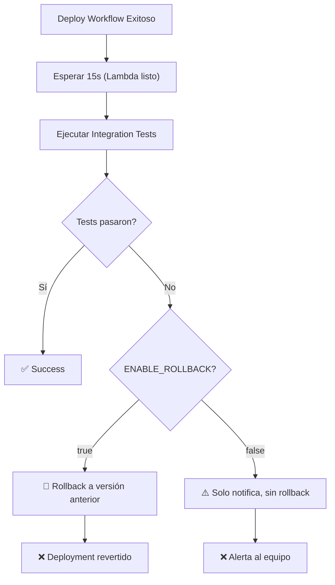

# Integration Tests - StoreApp.IntegrationTests

Este proyecto contiene SOLO los integration tests. Se ejecuta **después** del deploy a Lambda contra los endpoints reales a través de API Gateway.

## 📁 Estructura

```
StoreApp.IntegrationTests/
├── Fixtures/
│   ├── TestDatabaseManager.cs          (Gestiona PostgreSQL con TestContainers)
│   └── StoreAppWebApplicationFactory.cs (WebApplicationFactory personalizado)
├── Endpoints/
│   ├── BrandEndpointsTests.cs          (Tests de Brand endpoint)
│   └── ProductEndpointsTests.cs        (Tests de Product endpoint)
├── IntegrationTestBase.cs              (Clase base para todos los tests)
└── StoreApp.IntegrationTests.csproj    (Project file)
```

## 🚀 Ejecución

### Localmente (contra BD de test con TestContainers)

```bash
# Todos los tests
dotnet test src/StoreApp.IntegrationTests/

# Test específico
dotnet test src/StoreApp.IntegrationTests/ --filter "Name=GetBrands_WithValidParameters_ReturnsOkStatusAndBrandList"

# Con logs
dotnet test src/StoreApp.IntegrationTests/ --logger "console;verbosity=detailed"
```

### En CI/CD (contra Lambda)

Los tests se ejecutan automáticamente después de un deploy exitoso:

```yaml
# Triggers:
- Deploy a Lambda exitoso ✅
- O manual: workflow_dispatch
```

## 🔧 Workflow: `integration-tests.yml`



## 🎯 Variables Importantes

En GitHub Secrets, agregar:

```
API_GATEWAY_URL = https://ba3hjkli0e.execute-api.sa-east-1.amazonaws.com/prod
AWS_ACCESS_KEY_ID
AWS_SECRET_ACCESS_KEY
S3_BUCKET
LAMBDA_FUNCTION_NAME
```

## 📝 Configuración del Rollback

### Opción 1: Manual (workflow_dispatch)

```bash
# Ir a GitHub Actions → Integration Tests → Run workflow
# Seleccionar: enable_rollback = 'true' o 'false'
```

### Opción 2: Variable de Entorno

Editar `.github/workflows/integration-tests.yml`:

```yaml
env:
  ENABLE_ROLLBACK: 'false'  # Cambiar a 'true' para habilitar
```

### Opción 3: Secrets + Automático

```yaml
ENABLE_ROLLBACK: ${{ secrets.INTEGRATION_TESTS_ROLLBACK || 'false' }}
```

## 🧪 Agregar Nuevos Tests

### 1. Crear archivo en `Endpoints/`

```bash
touch src/StoreApp.IntegrationTests/Endpoints/CategoryEndpointsTests.cs
```

### 2. Heredar de `IntegrationTestBase`

```csharp
using System.Net;

namespace StoreApp.IntegrationTests.Endpoints;

public class CategoryEndpointsTests : IntegrationTestBase
{
    [Fact]
    public async Task GetCategories_ReturnsOk()
    {
        // Arrange
        var url = "/api/Categories?page=1&pageSize=20&onlyActive=true";

        // Act
        var response = await Client.GetAsync(url);

        // Assert
        Assert.Equal(HttpStatusCode.OK, response.StatusCode);
    }
}
```

### 3. Commit y Push

```bash
git add .
git commit -m "add: CategoryEndpointsTests"
git push origin main
```

→ Tests se ejecutarán automáticamente después del deploy.

## 📊 Tests Existentes

### BrandEndpointsTests.cs
- ✅ GET Brands (válido & validaciones)
- ✅ GET Brand por ID
- ✅ Paginación
- ✅ Filtros (activos/inactivos)

### ProductEndpointsTests.cs
- ✅ GET Products (válido & validaciones)
- ✅ GET Product por ID
- ✅ Búsqueda por categoría/brand
- ✅ Paginación
- ✅ Search

## 🔍 Debugging

### Ver logs detallados

```bash
dotnet test src/StoreApp.IntegrationTests/ --logger "console;verbosity=diagnostic"
```

### Conectarse a la BD de Test

El TestContainer espone PostgreSQL en puerto 5433:

```bash
psql -h localhost -p 5433 -U postgres -d storeapp_test
# Password: postgres_test_123
```

### Inspeccionar artefactos en GitHub

GitHub Actions → Integration Tests → Artifacts → `integration-test-results`

## ⚠️ Consideraciones Importantes

1. **BD Real** - Los tests usan PostgreSQL real (TestContainers)
2. **Sincronización** - El workflow espera 15s para que Lambda esté listo
3. **Rollback Configurable** - No es automático por defecto (evita sorpresas)
4. **Independencia** - No bloquea el deploy si falla
5. **Manual Override** - Siempre puedes ejecutar manualmente con/sin rollback

## 📚 Referencias

- [xUnit Testing Framework](https://xunit.net/)
- [Testcontainers .NET](https://testcontainers.com/docs/dotnet/intro/)
- [GitHub Actions Workflows](https://docs.github.com/en/actions/quickstart)
- [AWS Lambda Best Practices](https://docs.aws.amazon.com/lambda/latest/dg/best-practices.html)

## 🤝 Contribuir

Si encuentras un bug o quieres agregar tests:

1. Crea una rama: `git checkout -b feature/add-more-tests`
2. Commit cambios: `git commit -am 'Add tests for endpoint X'`
3. Push: `git push origin feature/add-more-tests`
4. Abre PR 💜
